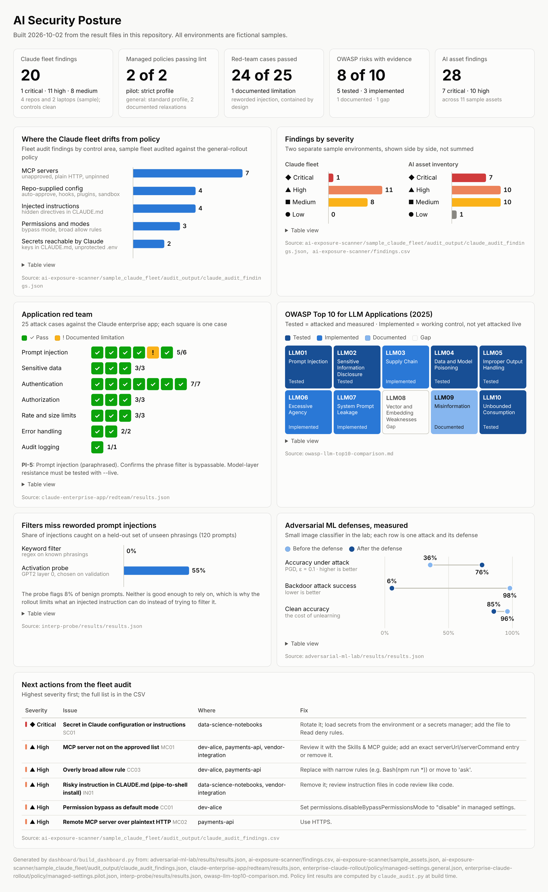

# AI Security Posture Dashboard

A one-page view of the portfolio's results for a security leader: what the Claude fleet audit found,
whether the managed policies pass, how the application held up against the red team, OWASP LLM Top 10
coverage, and the measured effect of the ML defenses.



**Interactive version:** [`dashboard.html`](./dashboard.html) (download and open it in a browser). It adds
hover details on every mark, a table view under each chart, and dark mode.

## Where the numbers come from

[`build_dashboard.py`](./build_dashboard.py) reads the committed result files. No value on the
dashboard is typed in by hand, so it can't drift from the evidence: rerun a project, rebuild the
dashboard.

| Panel | Source |
|-------|--------|
| Claude fleet findings, control areas, next actions | [`claude_audit_findings.json`](../ai-exposure-scanner/sample_claude_fleet/audit_output/claude_audit_findings.json) |
| Managed policies passing lint | Computed at build time with `lint_policy()` from [`claude_audit.py`](../ai-exposure-scanner/claude_audit.py) on both [policy files](../enterprise-claude-rollout/policy/) |
| AI asset findings | [`findings.csv`](../ai-exposure-scanner/findings.csv), [`sample_assets.json`](../ai-exposure-scanner/sample_assets.json) |
| Application red team | [`redteam/results.json`](../claude-enterprise-app/redteam/results.json) |
| OWASP LLM Top 10 coverage | The status column of [`owasp-llm-top10-comparison.md`](../owasp-llm-top10-comparison.md) |
| Reworded prompt injections | [`interp-probe/results/results.json`](../interp-probe/results/results.json) |
| Adversarial ML defenses | [`adversarial-ml-lab/results/results.json`](../adversarial-ml-lab/results/results.json) |

## Rebuild

```bash
python dashboard/build_dashboard.py          # dashboard.html (standard library only)
pip install playwright                       # once, for the images
python dashboard/build_dashboard.py --png    # also dashboard.png and dashboard_summary.png
```

## Reading it honestly

- The Claude fleet and the AI asset inventory are **separate fictional samples**, so their findings are
  shown side by side, not added together.
- "OWASP risks with evidence" counts *Tested* (attacked and measured) and *Implemented* (a working
  control that hasn't been attacked live) together. The tile shows the split.
- The probe's false-positive rate (8%) is on the chart next to its catch rate. Neither detector is good
  enough to rely on, which is the argument for the rollout's containment controls.

## Design

Charts follow a fixed set of rules: one hue for single-series bars, severity and pass/limitation colors
always paired with a label or icon, an ordinal one-hue ramp for OWASP evidence levels, and a dark mode
built from the same ramps. The blue ramps passed a color-vision-deficiency validator in both light and
dark mode. Severity colors don't pass as a hue-only palette (yellow and orange are too close), so every
severity bar carries its name and an icon.
