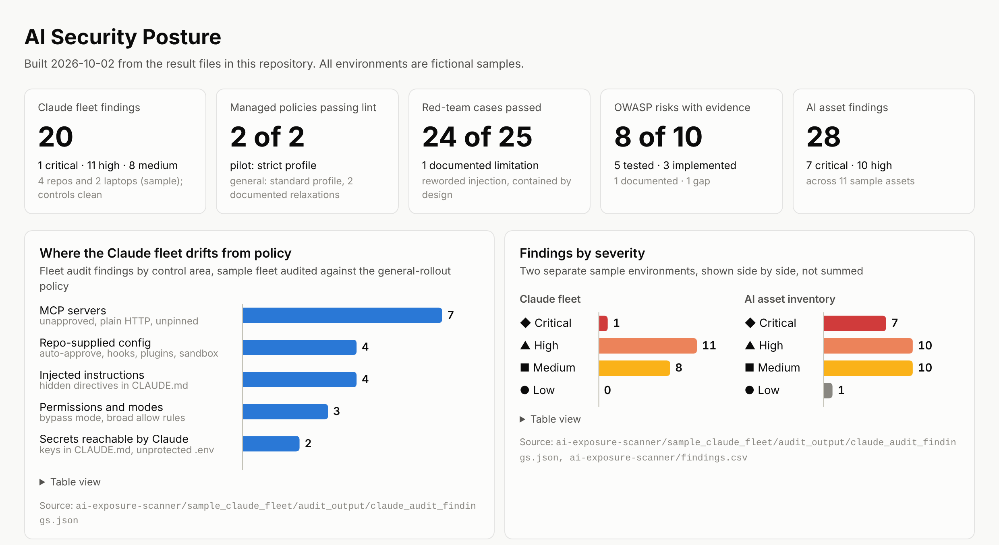

[](https://github.com/AbrahamCain/AI-security-engineering-portfolio/actions/workflows/tests.yml)

# AI Security Engineering Portfolio

Abraham Cain · Product security engineer (CISSP; SANS AI security training) applying
offensive-security and AppSec practice to AI/ML systems: secure enterprise AI rollout, LLM application
security, LLM red teaming, threat modeling, DevSecOps and AI governance.

[](./dashboard/)

<sub>Generated from this repo's result files by [`dashboard/build_dashboard.py`](./dashboard/). [Full dashboard →](./dashboard/)</sub>

## Start here: three results in three minutes

1. **Rolling out Claude across a company without losing control of it.** A phased plan from a
   30-person pilot to 4,000 employees, the actual Claude Code managed policy that enforces it, and a
   fleet auditor that found a cloned repo hiding instructions to read AWS credentials, plus 19 other
   exposures, in a sample fleet. → [Enterprise Claude rollout](./enterprise-claude-rollout/)
2. **A secure Claude app, attacked on purpose.** A Flask service on the Claude API with signed tokens, roles,
   PII tokenization and an audit log, then a 25-case scripted red team against it: 24 pass, and the one
   bypass (a reworded prompt injection) is documented, not hidden. The design limits the damage instead
   of trusting a filter: the model has no tools, no secrets, and its output is untrusted.
   → [Secure Claude app](./claude-enterprise-app/) · [Red-team assessment](./ai-red-team-assessment.md)
3. **The top risk was a design decision, not an exploit.** The risk assessment ranks "an LLM is making
   credit decisions" above any attack: it creates fairness, explainability and adverse-action problems,
   and is high-risk under the EU AI Act. → [Risk assessment](./nist-ai-risk-assessment.md) ·
   [Executive briefing](./executive-briefing.md)

All scenarios, systems and datasets are fictional. Every number comes from code in this repo that
re-runs in CI; none are edited by hand. Limitations and negative results are reported next to the
results.

**How this was built.** Developed with AI-assisted programming (Claude as a pair programmer). I set
the scope and the security judgments, and verified the results by running them. Ask me about any
design decision.

## Projects

### Build and break

| Project | What it is | Evidence |
|---------|-----------|----------|
| [Enterprise Claude Rollout](./enterprise-claude-rollout/) | Phased rollout plan, organization-wide threat model, data handling policy, Claude Code managed policies (pilot and general), monitoring and detections, agentic red-team plan, and a fleet auditor plus policy linter | 31 auditor tests; 20 findings in the sample fleet with 0 false positives on the control cases; both policies pass lint |
| [Secure Claude Enterprise App](./claude-enterprise-app/) | Flask + Claude API behind signed tokens, RBAC, rate limits, PII tokenization, output encoding, security headers and an audit log; hardened Docker image | 56 tests |
| [AI Red-Team Assessment](./ai-red-team-assessment.md) | Scripted attack harness against the app, plus eight defects found in its first version and fixed | 25 cases: 24 pass, 1 documented limitation |
| [AI Exposure Scanner](./ai-exposure-scanner/) | Python scanner for an AI asset inventory: credentials, IAM, APIs, storage, dependencies, model governance, SageMaker and Bedrock, plus the Claude fleet auditor | 66 tests; 28 findings across 11 assets |
| [Model X-ray (interpretability viewer)](./interp-viewer/) | Local web app that shows a language model's answer forming layer by layer, in plain English, plus a whole-vocabulary scan for backdoor triggers; tested on DistilGPT-2 with a backdoor planted by data poisoning | Scan flags the trigger (100% vs 25% runner-up) out of 50,257 words and flags nothing on the clean model; 11 tests |
| [DevSecOps Pipeline](./security/) | GitHub Actions: Bandit and Semgrep (SAST), pip-audit (SCA), Gitleaks (secrets), Trivy (image), OWASP ZAP (DAST) | Runs on every push |

### Assess and govern

| Document | What it is |
|----------|-----------|
| [AI Risk Assessment (NIST AI RMF)](./nist-ai-risk-assessment.md) | Risk register for a fictional credit platform: 8 risks with owners, MITRE ATLAS mapping, key risk indicators, and a 30/90-day plan |
| [Enterprise AI Threat Model](./enterprise-ai-threat-model.md) | STRIDE threat model of the app: 15 threats, each control linked to its test |
| [OWASP LLM Top 10 Coverage](./owasp-llm-top10-comparison.md) | All ten 2025 risks rated tested / implemented / documented / gap, with evidence |
| [ML Lifecycle Security Map (AWS)](./ml-lifecycle-cloud-security.md) | Threats and AWS controls per lifecycle stage; encryption vs tokenization vs masking |
| [EU AI Act Assessment](./eu-ai-act-assessment.md) | High-risk classification (Annex III 5(b)), obligations, and the deadline as moved by the Digital Omnibus |
| [Skills & MCP Security Review Guide](./claude-skills-mcp-security-review.md) | Approve/reject criteria for agent tools: blast radius, tool poisoning, definition pinning, token passthrough |
| [Executive Briefing](./executive-briefing.md) | One-page, non-technical summary for business leaders |

## How the pieces connect

```
Risk assessment ──► what could go wrong (NIST AI RMF, EU AI Act)
        │
Exposure scanner ──► finding it in configuration (incl. SageMaker / Bedrock)
        │
Secure app ──► building controls around an LLM
        │
Red team ──► attacking those controls, reproducibly
        │
Threat model + OWASP coverage ──► what remains, prioritized
        │
DevSecOps pipeline ──► keeping it that way on every change
        │
Enterprise Claude rollout ──► applying all of it to an organization-wide deployment
```

## Reproduce everything

```bash
git clone https://github.com/AbrahamCain/AI-security-engineering-portfolio.git
cd AI-security-engineering-portfolio
python -m venv .venv && source .venv/bin/activate

pip install -r ai-exposure-scanner/requirements.txt -r claude-enterprise-app/requirements-dev.txt
(cd ai-exposure-scanner && pytest tests -q && python scanner.py sample_assets.json)
(cd claude-enterprise-app && pytest tests -q && python redteam/run_redteam.py)
```

Python 3.10+. The red-team harness's model-layer probes need `ANTHROPIC_API_KEY` and `--live`.

## What this shows, and what it doesn't

**Shows:** working attacks and measured defenses at the application level (red team); an organization-wide Claude rollout enforced as policy code and
checked by a tested fleet auditor; security engineering practice (threat modeling, SAST/SCA/DAST,
container hardening, data protection); and governance fluency (NIST AI RMF, OWASP LLM Top 10, EU AI Act).
Limitations are stated next to results rather than left out.

**Doesn't show:** production scale, or model-level work such as adversarial ML and interpretability.
The app's rate limits are in memory and its audit log is local. The rollout's managed policy is linted
but hasn't run on a real fleet, and its agentic red-team plan is written, not executed. Live tests
against the Claude model, that red-team run, and RAG security (OWASP LLM08) are the next steps, as listed in the
[OWASP coverage](./owasp-llm-top10-comparison.md).

## Repository layout

```
├── enterprise-claude-rollout/ plan, threat model, data policy, policy/ (managed settings), monitoring, red-team plan
├── dashboard/                build_dashboard.py, dashboard.html, dashboard.png (generated from result files)
├── claude-enterprise-app/    app.py, Dockerfile, redteam/, tests/
├── ai-exposure-scanner/      scanner.py, claude_audit.py, sample_assets.json, sample_claude_fleet/, tests/
├── security/                 pipeline docs, gitleaks and ZAP config
├── .github/workflows/        tests.yml (ci)
└── *.md                      assessments, threat model, governance, briefing
```

## References

[NIST AI RMF](https://www.nist.gov/itl/ai-risk-management-framework) ·
[OWASP Top 10 for LLM Applications 2025](https://genai.owasp.org/llm-top-10/) ·
[EU AI Act](https://eur-lex.europa.eu/eli/reg/2024/1689/oj) ·
[MITRE ATLAS](https://atlas.mitre.org/) · [MITRE CWE](https://cwe.mitre.org/) ·
[Model Context Protocol](https://modelcontextprotocol.io/)
