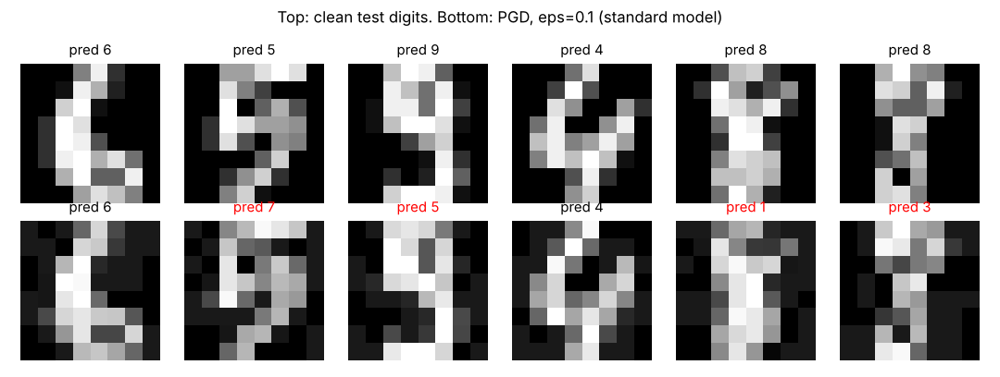
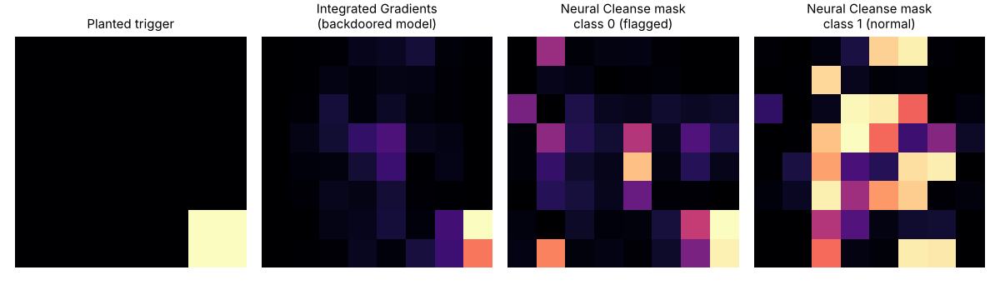
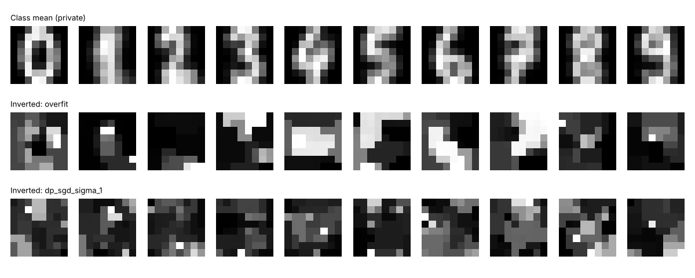

# Adversarial ML Lab Results

Generated 2026-10-02 15:57 UTC by `python run_all.py` · torch 2.14.1+cu130 · data: scikit-learn digits (898 train / 899 test)

## 1. Evasion (FGSM / PGD)

Clean accuracy: standard 96.6%, adversarially trained 96.9%.

| eps (L-inf) | Standard: FGSM | Standard: PGD-20 | Adv-trained: FGSM | Adv-trained: PGD-20 |
|---|---|---|---|---|
| 0.05 | 79.8% | 79.4% | 89.9% | 89.5% |
| 0.1 | 40.7% | 35.6% | 78.4% | 76.2% |
| 0.2 | 0.9% | 0.0% | 34.5% | 22.7% |

## 2. Backdoor poisoning

44 training images (5.0%) stamped with a 2x2 corner trigger and relabelled `0`.

| Model | Clean accuracy | Attack success rate |
|---|---|---|
| Trained on clean data | 96.6% | 0.0% |
| Trained on poisoned data | 96.1% | 98.0% |
| After Neural Cleanse unlearning | 85.4% | 5.6% |

**Detection (Neural Cleanse).** Flagged classes on the poisoned model: [0]; on the clean model: none. Anomaly index per class: [2.57, -1.76, 0.61, 0.1, 0.42, -0.51, -1.22, 0.83, -0.74, -0.1]. Top-4 pixels of the reversed mask: [36, 55, 57, 63] (true trigger: [54, 55, 62, 63]).

**Attribution (Captum Integrated Gradients).** The 4 trigger pixels are 6.2% of the image but receive 47.8% of attribution toward class 0 on the poisoned model, versus 24.1% on the clean model.

## 3. Membership inference (loss-threshold attack)

100 members vs 100 non-members, mean ± std over 5 seeds. AUC 0.5 = attacker does no better than chance.

| Target model | Train acc | Test acc | Attack AUC | DP epsilon (delta=1e-5) |
|---|---|---|---|---|
| overfit | 100.0% | 89.8% | 0.652 ± 0.022 | n/a |
| regularized | 99.0% | 86.8% | 0.623 ± 0.023 | n/a |
| dp_sgd_sigma_1 | 89.2% | 78.2% | 0.607 ± 0.016 | 26.4 |
| dp_sgd_sigma_2 | 63.0% | 48.2% | 0.591 ± 0.030 | 9.1 |
| dp_sgd_sigma_4 | 33.2% | 29.0% | 0.537 ± 0.009 | 3.8 |

## 4. Model inversion

Gradient ascent on each class logit from a blank image. Similarity is cosine similarity to the class's mean training image.

| Target model | Own-class similarity | Other-class similarity | Reconstructions closest to their own class |
|---|---|---|---|
| overfit | 0.781 | 0.638 | 100.0% |
| dp_sgd_sigma_1 | 0.720 | 0.626 | 90.0% |

