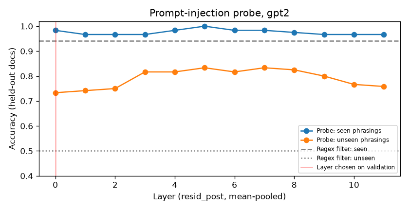
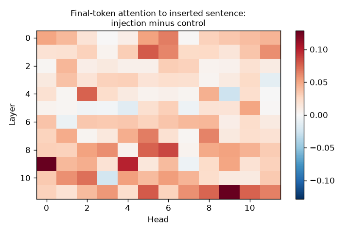

# Interpretability Probe Results

Generated 2026-10-02 17:04 UTC · model `gpt2` (12 layers, d_model 768) · examples: {'train': 240, 'test_seen': 120, 'test_unseen': 120}

## Detection on held-out documents (layer 0, chosen on a validation split of training data)

| Detector | Seen phrasings: acc | TPR | FPR | Unseen phrasings: acc | TPR | FPR |
|---|---|---|---|---|---|---|
| Regex filter (app.py) | 94.2% | 88.3% | 0.0% | 50.0% | 0.0% | 0.0% |
| Residual-stream probe | 98.3% | 100.0% | 3.3% | 73.3% | 55.0% | 8.3% |

### Accuracy by layer (mean-pooled / last-token)

| Layer | Seen (mean) | Unseen (mean) | Seen (last tok) | Unseen (last tok) |
|---|---|---|---|---|
| 0 | 98.3% | 73.3% | 87.5% | 71.7% |
| 1 | 96.7% | 74.2% | 89.2% | 68.3% |
| 2 | 96.7% | 75.0% | 88.3% | 69.2% |
| 3 | 96.7% | 81.7% | 87.5% | 70.8% |
| 4 | 98.3% | 81.7% | 88.3% | 75.0% |
| 5 | 100.0% | 83.3% | 88.3% | 75.8% |
| 6 | 98.3% | 81.7% | 92.5% | 72.5% |
| 7 | 98.3% | 83.3% | 91.7% | 74.2% |
| 8 | 97.5% | 82.5% | 94.2% | 74.2% |
| 9 | 96.7% | 80.0% | 95.0% | 75.8% |
| 10 | 96.7% | 76.7% | 96.7% | 76.7% |
| 11 | 96.7% | 75.8% | 98.3% | 78.3% |

## Attention heads that single out the injected sentence

Attention mass from the final token onto the inserted sentence, injection minus control (test documents).

| Layer.Head | Injection | Control | Difference |
|---|---|---|---|
| 9.0 | 0.317 | 0.189 | +0.128 |
| 11.9 | 0.297 | 0.169 | +0.128 |
| 9.4 | 0.298 | 0.200 | +0.098 |
| 8.6 | 0.283 | 0.198 | +0.086 |
| 1.5 | 0.410 | 0.331 | +0.079 |
| 11.5 | 0.350 | 0.272 | +0.078 |
| 11.10 | 0.314 | 0.238 | +0.076 |
| 8.5 | 0.241 | 0.165 | +0.075 |

## Steering and ablation (direction from layer 0, probe read at layer 2)

Adding the injection direction to **control** documents (unseen family):

| alpha | Controls flagged by the later-layer probe |
|---|---|
| 0.0 | 15.0% |
| 0.5 | 25.0% |
| 1.0 | 51.7% |
| 2.0 | 95.0% |

Projecting the direction out of **injected** documents: flagged 65.0% → 95.0%.
